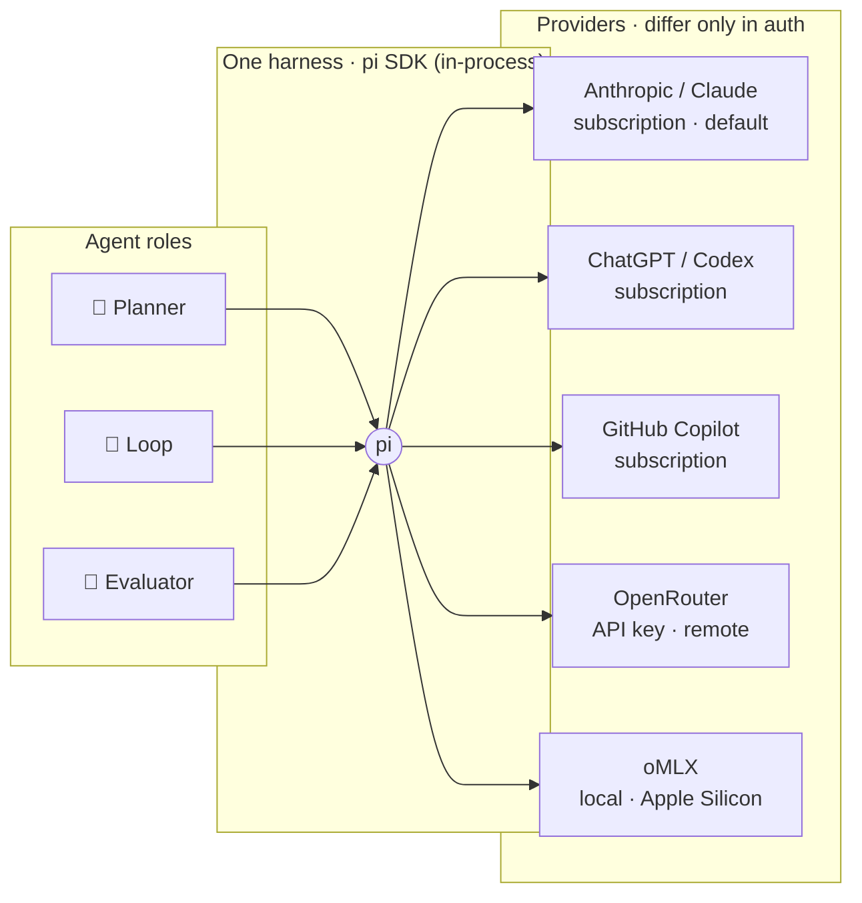
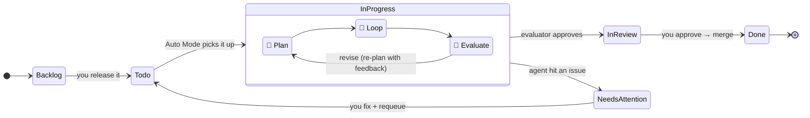
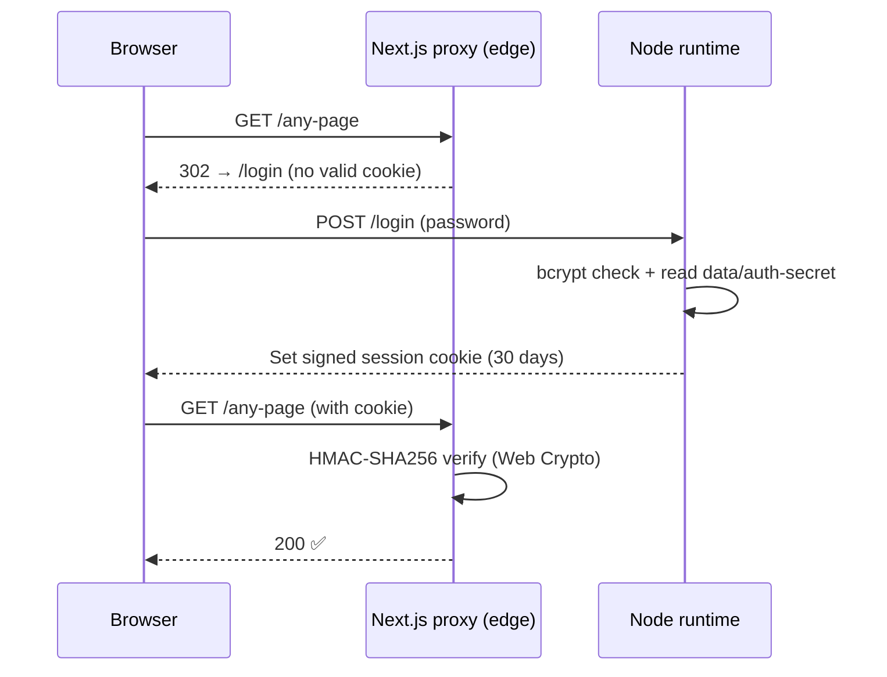

<div align="center">

```
     ██████╗  █████╗ ██████╗ ██╗   ██╗██╗     ███████╗
     ██╔══██╗██╔══██╗██╔══██╗██║   ██║██║     ██╔════╝
   ██████╔╝███████║██║  ██║██║   ██║██║     █████╗
   ██╔══██╗██╔══██║██║  ██║██║   ██║██║     ██╔══╝
██║  ██║██║  ██║██████╔╝╚██████╔╝███████╗██║
╚═╝  ╚═╝╚═╝  ╚═╝╚═════╝  ╚═════╝ ╚══════╝╚═╝
·  the wolf that plans  ·
```

# Radulf

**A local-first agent loop that turns a task into a reviewable diff.**

[](https://github.com/lhansen-dev/radulf/actions/workflows/ci.yml)
[](LICENSE)
[](https://nodejs.org)
[](https://nextjs.org)
[](https://www.typescriptlang.org)

_Point it at a repo. Describe a task. Watch the wolf plan, work, and hand you back a diff._

</div>

---

## What is this?

> **Radulf** (**RAH-doolf**) — from Old Norse _Ráðúlfr_: `ráð` ("counsel, plan") +
> `úlfr` ("wolf"). **The wolf that plans.** It's also the root of the name "Ralph" —
> a nod to the [Ralph Wiggum loop](https://ghuntley.com/loop/) beating at its core.

You describe a coding task against a local Git repo. Radulf's agents — a
**planner**, a **loop**, and an **evaluator** — carry it through a
[Ralph Wiggum loop](https://ghuntley.com/loop/) inside an isolated git worktree,
retrying and revising until the acceptance criteria hold. What comes back to you
is a reviewable diff. You approve; it merges.

```
   describe ──▶  🧭 plan  ──▶  🔁 loop  ──▶  🔎 evaluate  ──▶  📋 diff  ──▶  ✅ merge
      you            └──────── the wolf ────────┘   ▲            you          you
                                    │              revise
                                    └────────────────┘
```

**Auto Mode** pulls the next queued task the moment a slot frees, so the pipeline
keeps moving without you. **[Improvement Runs](#improvement-runs)** go further:
Radulf proposes its own work, drives it end to end on auto-approve, and stacks
every approved change on one branch until the time budget runs out.

Radulf's own repo is a valid target — so **you can point it at itself** and let it
improve its own code.

> **Status:** working application under active development. Card lifecycle
> orchestration, review/merge flows, multi-provider agents, analytics, benchmarks,
> optional authentication, and runtime-history cleanup are all implemented.
> The full guides live in [`docs/`](docs/WHAT_IS_RADULF.md) and are browsable
> in-app under the **Docs** tab; [`specs/`](docs/DESIGN_HISTORY.md) is the dated
> record of what was decided and when.

---

## Table of contents

- [The big idea](#the-big-idea)
- [Quick start](#quick-start) · _clone, install, log in, run_
- [Requirements](#requirements)
- [How it works](#how-it-works)
- [Improvement Runs](#improvement-runs) · _let it improve a repo on a time budget_
- [Configuring agents](#configuring-agents)
- [Authentication (optional)](#authentication-optional)
- [Make targets](#make-targets)
- [Project layout](#project-layout)
- [Contributing](#contributing)
- [License](#license)

---

## The big idea

Every agent role runs through **one harness: [pi](https://github.com/earendil-works/pi)
in SDK mode**, in-process — no subprocess, no `claude`/`codex`/`opencode` CLIs to install.
Each role can use **any supported provider**; the provider only decides _auth_.



**Next.js (App Router) + TypeScript + SQLite (Drizzle)**, single user on `localhost` by
default. Loops work in **per-card git worktrees** so your main checkout is never touched.
See [`specs/13-single-pi-sdk-harness.md`](specs/13-single-pi-sdk-harness.md) for the harness design.

---

## Quick start

```bash
# 1 · Clone
git clone https://github.com/lhansen-dev/radulf.git
cd radulf

# 2 · Install
make install

# 3 · Log in a provider (opens pi — type /login, then Ctrl+C)
make login

# 4 · Run
make dev
```

Then open **[http://localhost:3000](http://localhost:3000)** 🎉

> [!NOTE]
> `main` is the stable branch and always sits at the latest release, so the clone
> above needs no extra flags. To try unreleased work, clone the integration
> branch instead — `git clone -b beta https://github.com/lhansen-dev/radulf.git`
> — or pin an exact release with `-b v1.0.0`.

The SQLite database and every runtime directory (`./data`, plus the agent-writable
`./worktrees`, `./plans` and `./runtmp` beside it) are created automatically on first
run and are all gitignored — **no manual migration step needed**.

> [!TIP]
> **First time here?** Once the dev server is up, open the in-app **Docs** tab
> (desktop rail / mobile bottom nav, or [`/docs`](http://localhost:3000/docs)). Its
> Start-here group walks you through the idea, getting set up, and how the pipeline
> actually works — the same guides that live in [`docs/`](docs/WHAT_IS_RADULF.md).

### Before your first loop: log in a provider

Radulf needs at least one provider. For the subscription providers, this is a **one-time**
interactive login through pi's own UI, pointed at Radulf's agent dir:

```bash
make login   # opens pi → type /login → pick Claude, ChatGPT, or Copilot
```

`/login` is a command you type **inside** pi, not a shell command. Quit pi when it
reports success (`Ctrl+C`). Use the `make login` target rather than running `pi`
yourself — [`PROVIDERS.md`](docs/PROVIDERS.md#the-five-providers) explains where the
credential lands and what goes wrong otherwise.

OpenRouter and oMLX need **no login** — set them in the app's **Settings** page (an
OpenRouter API key, or the oMLX base URL). See [Requirements](#requirements) for the full matrix.

---

## Requirements

| What | Detail |
|------|--------|
| 🖥️ **OS** | **macOS (Apple Silicon or Intel).** Linux (including WSL2) is best-effort: the sandbox has a Linux implementation, but it is not release-verified. Native Windows and WSL1 are not supported. |
| 🟢 **Node** | 22 or newer |
| 📦 **pi SDK** | [`@earendil-works/pi-coding-agent`](https://github.com/earendil-works/pi) — a pinned dependency. No global install, no CLIs. |
| 🔒 **Sandbox runtime** | [`@anthropic-ai/sandbox-runtime`](https://github.com/anthropic-experimental/sandbox-runtime) — a pinned dependency ([spec 14](specs/14-sandboxing.md)). Kernel-enforced containment for agent bash: Seatbelt (`sandbox-exec`) on macOS, bubblewrap + a seccomp filter on Linux. On **Ubuntu 24.04+**, the default AppArmor policy blocks bubblewrap's unprivileged user namespace — Radulf's startup preflight detects this (`kernel.apparmor_restrict_unprivileged_userns=1`) and logs the exact remediation (grant `bwrap` the `userns` capability via an AppArmor profile, or set the sysctl to `0`). The sandbox is on by default (`sandboxEnabled` in Settings); turning it off is a deliberate, logged escape hatch — see spec 14's Failure semantics. **How it's implemented:** [`SANDBOXING.md`](docs/SANDBOXING.md). |
| 🔑 **A provider** | At least one of the five below |

**Provider matrix** — pick one or mix per role:

| Provider | Auth | Where | Notes |
|----------|------|-------|-------|
| 🟣 **Claude** (default) | `make login` → `/login` | Claude Pro/Max subscription | Third-party harness usage billed per token as extra usage |
| 🟢 **ChatGPT (Codex)** | `make login` → `/login` | ChatGPT Plus/Pro subscription | — |
| ⚫ **GitHub Copilot** | `make login` → `/login` | GitHub Copilot subscription | — |
| 🔵 **OpenRouter** | API key | remote | Bring your own model. Set in Settings — no login |
| 🟠 **oMLX** | base URL | local, Apple Silicon | Optional. Set base URL in Settings — no login |

> `make login` is a one-time interactive step for the subscription providers; `/login`
> is typed inside pi. Full detail in [`PROVIDERS.md`](docs/PROVIDERS.md).

### Disk limits ([spec 14](specs/14-sandboxing.md))

Nothing in the container/cgroup world bounds disk *use* the way `memory.max`
bounds RAM, and legacy UNIX quotas are per-UID — since Radulf runs as the
same user as the agent, a quota would throttle the server alongside the
agent it's supposed to contain. The default on every platform is a
**polling watchdog + ballast file**: the orchestrator samples worktree size
and volume free space every few seconds and fails a run past a threshold
with real headroom; a pre-allocated few-GB ballast file is deleted under
disk pressure to keep the host usable while it recovers. This needs no
operator setup and is what a fresh install gets — reactive, not preventive
(an agent can write several GB between samples on fast NVMe).

Two hardened, opt-in alternatives for operators who want a real ceiling
(macOS only — Linux gets an actual hard wall from the cgroup v2 `memory.max`
already in force):

- **APFS volume with a quota** — a genuine, kernel-enforced ceiling. Writes
  past it fail with `ENOSPC` instead of the watchdog's best-effort catch.
  One-time setup, requires disk ownership:

  ```bash
  # Find your container's disk identifier (usually disk3s1's container, e.g. disk3):
  diskutil list

  # Add a volume with a 20 GB quota, mounted where RADULF_WORKTREES_DIR points:
  diskutil apfs addVolume disk3 APFS RadulfWorktrees -quota 20g
  ```

  Point `RADULF_WORKTREES_DIR` at the new volume's mount point. Space stays
  shared from the container's pool — the quota caps allocation, it doesn't
  reserve a fixed partition, so it costs no disk until a run actually fills
  it. Worktrees living on a different volume from `data/` is fine: `git
  worktree` uses a pointer file, not hardlinks, so it works across volumes
  (unlike `git clone --local`).
- **Sparse disk image** (`hdiutil`, APFS sparsebundle) — created and
  destroyed **per run**, which also handles cleanup automatically. Two
  costs: a sparsebundle doesn't reclaim freed space without `hdiutil
  compact`, and detaching it fails while any process still holds a file
  open inside it — which is exactly why process-group reaping runs before
  every integrity check (spec 14 Phase 1f/1g), not after.

Every run row stamps `diskLimitMechanism` so "what actually bounded this run"
is answerable from the run detail rather than assumed from the platform:
`cgroup` on Linux; on macOS, `apfs-quota` is **auto-detected** when the run's
worktree lives on a quota volume (diskutil reports the volume's `TotalSize`
below the shared container size — verified live against a real quota volume),
otherwise `watchdog`. `sparse-image` stays a reserved value for the per-run
sparsebundle option, which is not auto-detected.

---

## How it works

A card starts safely in **Backlog**. Move it to the ordered **Todo** queue when it's
ready — **Auto Mode** (on by default) then picks it up. The pipeline runs, and the card
advances through the lifecycle on its own.



**The pipeline, step by step:**

1. **🧭 Plan** — a frontier agent turns the card into a plan (`PLAN.md`, `PROMPT.md`,
   acceptance criteria).
2. **🔁 Loop** — a loop agent implements one task at a time against a git worktree,
   running its targeted check each iteration. The repo _is_ the memory between fresh-context runs.
3. **🔎 Evaluate** — the **sole whole-card verifier**. It independently inspects the loop's
   diff and runs every acceptance criterion, then either sends concrete feedback back to
   the planner (`revise` → re-plans on top of the branch) or clears the change (`approve`).
   A bounded revision limit escalates to you if it stalls.
4. **📋 Review** — the evaluator-cleared diff waits in **In Review** with diff + transcript.
   Approve to merge into **Done**; reject with feedback to send it back to the planner.

**States at a glance:**

| State | Meaning |
|-------|---------|
| `Backlog` | Parked. Never auto-scheduled. |
| `Todo` | Ordered execution queue. Auto Mode pulls from here. |
| `In Progress` | Planning / execution / evaluation pipeline is active. |
| `In Review` | Evaluator-cleared diff is ready for your approval. |
| `Needs Attention` | An agent hit an issue that needs manual intervention. |
| `Done` | Approved and merged. |

> [!NOTE]
> **One ticket at a time.** A single card runs the planner, loop, or evaluator at any
> moment; the next card starts only when that slot frees. There's no parallelism setting —
> local models own the machine's unified memory, so the queue is always serial.

While a task loops you can **pause** it (the current iteration finishes, then the card
waits in a `paused` state) and **continue** later — optionally after editing its per-card
`plannerModel`, `loopModel`, and `evaluatorModel` overrides.

> These lifecycle states are a model the orchestrator advances, not lanes you drag
> things between. The UI is a mobile-first, attention-ordered
> [Work feed](specs/10-mobile-first-ui.md): what needs you, what's running now,
> what's queued next.

---

## Improvement Runs

Don't want to write the cards yourself? **Details ▸ Start improvement run** hands
a repo a time budget and lets Radulf fill it. Pick a base branch, optionally a
**Focus** (_"improve test coverage"_), and how long it may work.

The run then loops until the budget is spent: propose **one** improvement → make
a card for it → drive it through the same plan/loop/evaluate pipeline with
auto-approve → merge the approved change into a single feature branch
`ralph/improve-<ts>`. Each new proposal is made against that branch's tip, so it
builds on everything landed so far.

```
propose one ─▶ card (auto-approve) ─▶ plan ▶ loop ▶ evaluate ─▶ merge
      ▲                                                          │
      └────────────── until the budget runs out ─────────────────┘
```

- ⏱️ **The clock is a soft gate** — checked between tasks, so a task in flight
  always finishes. **Stop** works the same way.
- 🧱 **The branch is the deliverable** — never auto-deleted. Review the
  accumulated diff afterwards, then merge it or bin it.
- 🛟 **It gives up sensibly** — a rejected card is left in Needs Attention for
  you, and three failures in a row end the run instead of burning the budget.
- 💾 **It survives a restart** — run state is persisted and drivers re-attach on
  boot.

> [!WARNING]
> A run spends real tokens on every cycle — a planner pass *plus* a full
> pipeline per card. Start with ~30 minutes on a repo you're happy to throw a
> branch away from.

📖 Full reference: [`docs/IMPROVEMENT_RUNS.md`](docs/IMPROVEMENT_RUNS.md) · design
rationale: [`specs/06-self-improvement.md`](specs/06-self-improvement.md)

---

## Configuring agents

Open the **Settings** page in the app to choose which provider and model each role uses:

| Role | Job |
|------|-----|
| 🧭 **Planner** | Determines the execution plan for a card. |
| 🔁 **Loop** | Implements one task at a time and runs its targeted check against the git repo. |
| 🔎 **Evaluator** | The sole whole-card verifier — runs every acceptance criterion, inspects the diff, and returns `approve` or concrete `revise` feedback. On approve it also writes the card summary and refreshes any docs the change made stale. |

There is no separate summarizer role; the evaluator writes the summary.

Each role has a **provider** picker (anthropic, chatgpt, copilot, omlx, or openrouter), a
**model** picker, and a **reasoning-level** picker (pi's thinking level — default **Medium**
— applied across every provider).

- The **oMLX base URL** defaults to `http://127.0.0.1:8000`.
- Set an **OpenRouter API key** in Settings to use OpenRouter models.
- Every provider runs through the one [pi coding agent](https://github.com/earendil-works/pi)
  harness (SDK mode); the provider only determines auth — anthropic, chatgpt, and copilot
  use the subscription credentials from `make login`, openrouter your API key, and omlx
  your local server.

> [!IMPORTANT]
> If you pick the **oMLX** provider, ensure oMLX is running with at least one
> tool-capable model and reachable at the configured base URL (default
> `http://127.0.0.1:8000`) **before** starting a loop.

---

## Authentication (optional)

When deploying Radulf beyond localhost, protect every page and API route behind a
single-password login. Set `RADULF_AUTH_PASSWORD_HASH` to a bcrypt hash of your password.
When this variable is **unset**, auth is disabled and the app runs in default no-auth mode
(appropriate for localhost development).

```bash
# Generate a bcrypt hash of your chosen password
node -e 'console.log(require("bcryptjs").hashSync(process.argv[1], 12))' -- '<password>'
```

Set the result as `RADULF_AUTH_PASSWORD_HASH`.

<details>
<summary><b>How auth works under the hood</b> (click to expand)</summary>

<br>



- **Logging in:** Visit any page → redirected to `/login`. On success you get a signed
  session cookie valid for **30 days**. To clear it, `POST /api/auth/logout` (redirects back to `/login`).
- **Rate limiting:** With `RADULF_TRUSTED_PROXY_IP_HEADER` set, each client address gets
  **5 failed attempts per minute**, then `429 Too Many Requests`. Without it every direct
  request shares one budget, so a hard cutoff would be an operator lockout — that mode
  escalates delay instead (2s per recent failure, capped at 15s) and never refuses the
  correct password. See [Authentication](docs/AUTHENTICATION.md).
- **Revoking sessions:** Cookies are HMAC-signed with the secret in `data/auth-secret`;
  there's no server-side session store. The kill switch for a leaked cookie is **rotating
  the secret** — delete `data/auth-secret` and restart; a fresh secret invalidates every
  outstanding cookie at once.
- **Cross-origin requests:** Mutating requests are accepted only from localhost origins and,
  when set, the hostname in `RADULF_ALLOWED_ORIGIN` (e.g. `RADULF_ALLOWED_ORIGIN=radulf.example.com`).
  Set it when deploying behind a public hostname. This check runs **whether or not auth is
  enabled** — the no-auth default is exactly when a page you merely visit must not be able to
  drive your local instance. Clients that send no `Origin` at all (curl, scripts) are unaffected.
- **Provider credentials:** API keys are write-only over HTTP. `GET /api/settings` returns
  `••••••••` for any key that is set, and sending that marker back leaves the stored value
  alone, so the settings form round-trips without the key ever reaching the browser.
- **Under the hood:** An HMAC-SHA256 session secret is generated on first boot and stored in
  `data/auth-secret` (gitignored). The Next.js request proxy uses Web Crypto to verify the
  signed cookie on every request; the bcrypt check and file I/O happen only in Node runtime
  modules, so the proxy stays edge-compatible.

</details>

---

## Make targets

All tasks are driven through the [`Makefile`](Makefile) — run `make` for the
full list. It is the single source of truth: CI and the release workflow call
these same targets.

| Command | What it does |
|---------|--------------|
| `make install` | 📥 Install dependencies from the lockfile |
| `make login` | 🔑 Open pi against Radulf's agent dir to log in a subscription provider (type `/login`) |
| `make dev` | 🔥 Start the Next.js dev server with hot reload |
| `make build` | 📦 Build the application for production |
| `make start` | 🚀 Start the production server (run `build` first) |
| `make lint` | 🧹 Run ESLint across the codebase |
| `make test` | 🧪 Run unit, component, route, and lifecycle integration tests |
| `make typecheck` | 🔍 Type-check without emitting files |
| `make check` | ✅ Run tests, lint, type-checking, and a production build (the CI gate) |
| `make db-generate` | 🗂️ Generate a migration from schema changes |
| `make db-migrate` | ⬆️ Apply pending migrations |
| `make db-studio` | 🔎 Open Drizzle Studio |
| `make clean` | 🧽 Remove build output and caches |
| `make release VERSION=1.0.0` | 🏷️ Bump version, tag, and push — triggers the release workflow |

---

## Project layout

```
radulf/
├── src/
│   ├── app/          Next.js App Router routes and UI components
│   ├── server/       Orchestrator, runners, and provider integrations
│   └── db/           Drizzle schema definitions
├── drizzle/          Generated SQL migration files
├── docs/             The guides, browsable in-app under the Docs tab
├── specs/            Dated design decision log  → see docs/DESIGN_HISTORY.md
├── benchmarks/       Repeatable loop-performance fixtures and runners
├── data/             Gitignored runtime state (SQLite DB, transcripts, provider auth)
└── worktrees/        Gitignored per-card git worktrees — beside data/, never inside it
```

`docs/` is what you read to understand Radulf; `specs/` is the record of what was
decided and when. Specs are never rewritten to match the present — a later spec
supersedes an earlier one, and
[`docs/DESIGN_HISTORY.md`](docs/DESIGN_HISTORY.md) tracks which.

| Directory | Contents |
|-----------|----------|
| `src/app` | Next.js App Router routes and UI components |
| `src/server` | Orchestrator, runners, and provider integrations (mapped in [`docs/ARCHITECTURE.md`](docs/ARCHITECTURE.md)) |
| `src/db` | Drizzle schema definitions |
| `drizzle` | Generated SQL migration files |
| `docs` | The guides served by the in-app Docs tab |
| `specs` | Dated design decision log (see [`docs/DESIGN_HISTORY.md`](docs/DESIGN_HISTORY.md)) |
| `benchmarks` | Loop-performance benchmark fixtures and runners (see [`benchmarks/snake-tui/README.md`](benchmarks/snake-tui/README.md)) |
| `data` | Gitignored runtime state (SQLite DB, transcripts, provider auth). Denied to agents wholesale by the sandbox |
| `worktrees`, `plans` | Gitignored agent-writable dirs, siblings of `data/` so that deny needs no carve-out |

---

## Contributing

Contributions are welcome! 🐺 See [`CONTRIBUTING.md`](CONTRIBUTING.md) for local setup,
the `make check` gate CI enforces, and PR guidelines. Please report security issues
privately per [`SECURITY.md`](SECURITY.md) rather than in a public issue.

---

## License

Radulf is released under the [MIT License](LICENSE).

<div align="center">

---

**Built to plan its own future.** Point it at itself and watch. 🐺

<sub>from Old Norse <i>Ráðúlfr</i> — the wolf that plans</sub>

</div>
